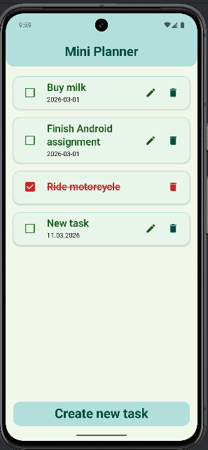
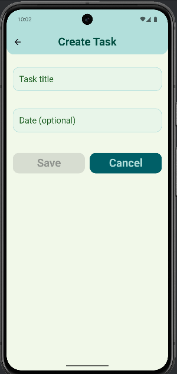
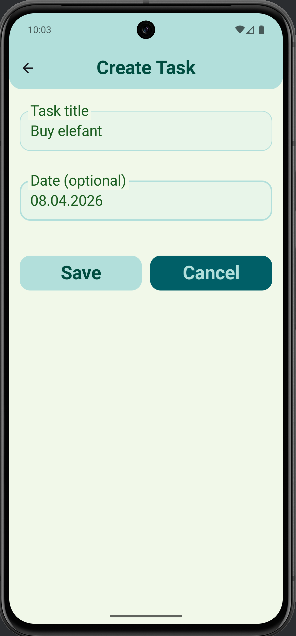
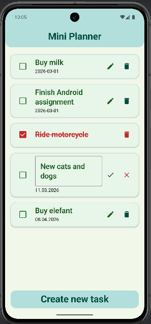
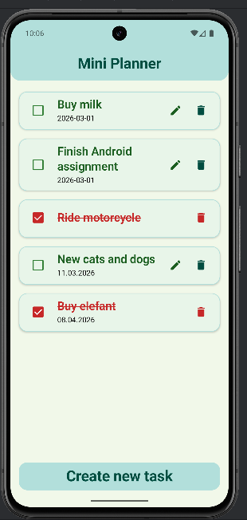

# Mini Planner (ToDo App)

Mini Planner on lihtne Android ToDo rakendus, mis võimaldab kasutajal lisada, 
muuta ja kustutada ülesandeid.  

Rakendus toetab ka ülesande märkimist tehtuks ning kuupäeva lisamist.  
Kõik ülesanded salvestatakse seadme lokaalsesse salvestusse (JSON), 
seega jäävad need alles ka pärast rakenduse sulgemist.

## Features

Rakendus võimaldab:

- lisada uusi ülesandeid
- muuta ülesande teksti
- kustutada ülesandeid
- märkida ülesanne tehtuks / tegemata
- lisada ülesandele valikuline kuupäev
- kontrollida kuupäeva formaati (DD.MM.YYYY)
- salvestada ülesanded lokaalsesse salvestusse (JSON)
- laadida salvestatud ülesanded rakenduse käivitamisel

## Tech stack

Rakendus on loodud kasutades:

- **Kotlin**
- **Jetpack Compose**
- **Navigation Compose**
- **Material 3**
- **Android Studio**
- **SharedPreferences** (JSON storage)

## Kuidas rakendust käivitada

1. Ava projekt **Android Studios**
2. Sünkroniseeri Gradle failid (Sync Project with Gradle Files)
3. Käivita rakendus emulaatoris või Android seadmes
4. Rakendus avaneb ülesannete nimekirja ekraaniga

## Team members

**Jekaterina Shashkina**
- kasutajaliidese (UI) disain
- ekraanide loomine Jetpack Compose abil
- komponentide ja stiilide loomine

**Nadia Artamonova**
- ülesannete oleku haldus (state management)
- CRUD loogika (add / edit / delete / toggle)
- ülesannete salvestamine ja laadimine JSON salvestusest

## Ekraanipildid

### Task list screen
Sellel ekraanil kuvatakse kõik ülesanded.  

Kasutaja saab märkida ülesande tehtuks, seda muuta või kustutada.

### Add Task Form
Sellel vormil saab kasutaja lisada uue ülesande ning soovi korral määrata kuupäeva.

### Add Task Screen
Sellel ekraanil kasutaja juba sisestas uue ülesande pealkirja ning kuupäeva.  

Ülesanne salvestatakse pärast nupu **Save** vajutamist.

### Edit Task
Kasutaja saab olemasolevat ülesannet muuta otse nimekirjas.  

Muudatuse kinnitamiseks kasutatakse linnukese nuppu ning tühistamiseks ristiga nuppu.

### Completed Task
Kui kasutaja märgib ülesande tehtuks, muutub selle olek.  

Ülesanne kuvatakse läbikriipsutatud tekstiga ning märgitakse punase värviga.

